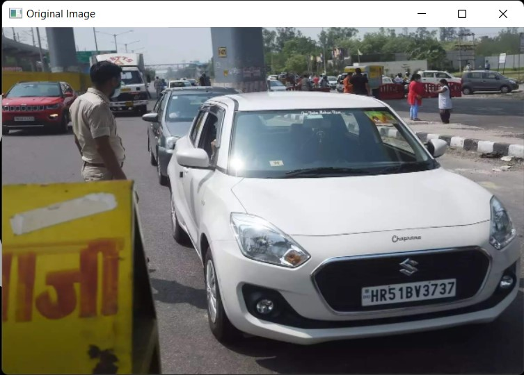
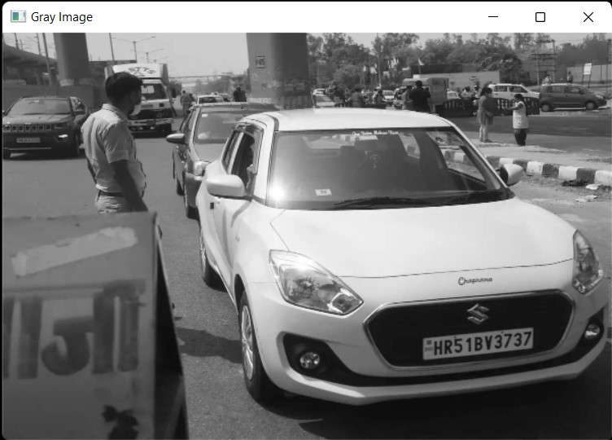
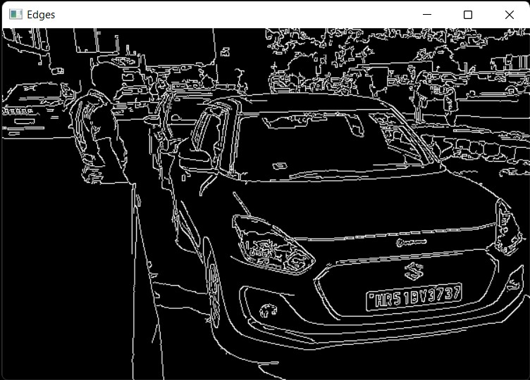
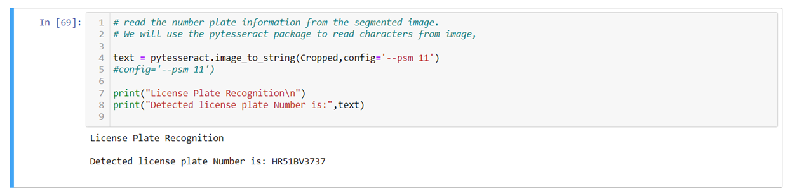

# VEHICLE-LICENSE-PLATE-DETECTION

Detection and isolation of the number plate from an image consisting of a vehicle followed by using various means to extract the text within the isolated license number plate image.

Step 1: Input consists of a picture of the vehicle whose license plate number should be detected.

Step 2: In the next step, we convert the RGB image to grayscale to discard information that is not needed for processing.

Step 3: The grayscale image is then preprocessed using bilateral filtering. A bilateral filter is an image smoothing filter that preserves edges, reduces noise, and is non-linear. The intensity of each pixel is replaced by a weighted average of intensity values from nearby pixels.

Step 4: Then, we use the canny edge detection method to detect edges. Canny edge detection is a technique for extracting useful structural information from different vision objects and significantly reducing the amount of data processing required.

Step 5: In order to extract the license plate from the image, we extract contours that have a rectangle shape with four sides and a closed figure.  (A contour is defined as the line that joins all the points along the boundary of an image)

Step 6: Next, we isolate the contours (License Plate) by cropping by its position within the original image.

Step 7: Our next step is to read the cropped image with the Pytesseract package and extract the characters from it.

